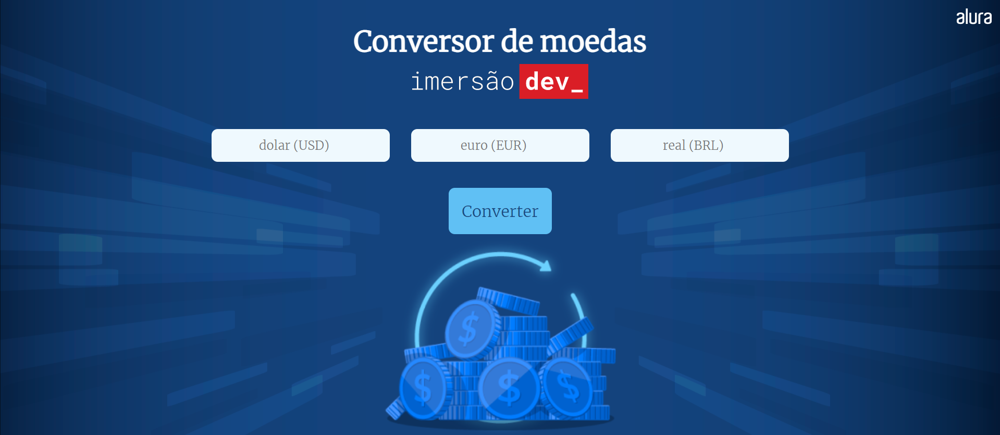

<h1 align="center">Currency Converter</h1>

This project is a simple currency converter made with CSS, HTML and JavaScript.
 
This project is a part of an event by <a href="https://www.alura.com.br/"> Alura.</a>

## Getting Started

Click [here](https://haushinka56.github.io/currency-converter/) to start.
 

  

## How it works

The user inputs a value and selects the currency they want to convert from, and the output shows the equivalent value in the other two currencies.

## Technologies Used

- HTML
- CSS
- JavaScript
- Git
- GitHub

## License

This project is licensed under the MIT License - see the [LICENSE.md](LICENSE.md) file for details.

  

## Note

Please note that the exchange rates used in this project are updated by the author and may not reflect reality. Use this project for educational purposes only.
